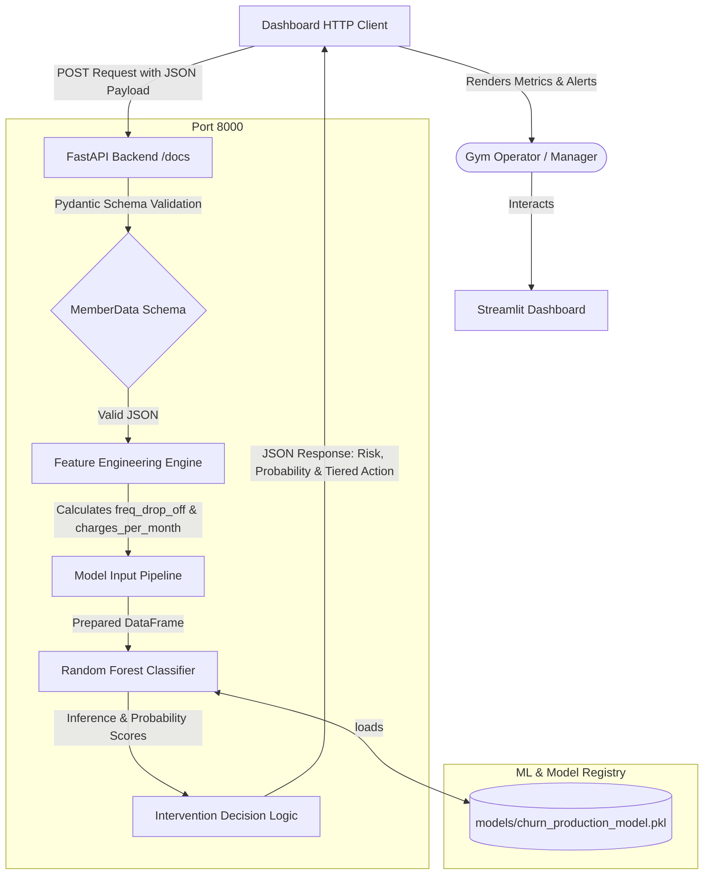

# 🏋️ Fitness Member Retention & Churn Engine

An end-to-end, production-grade machine learning microservice and analytics dashboard designed to predict customer churn in fitness clubs and trigger automated, probability-based customer retention workflows.

This project implements a **FastAPI** backend API serving a **Scikit-Learn Random Forest Classifier** and an interactive **Streamlit** dashboard for gym operators to inspect member churn risk in real-time.

---

## 🚀 Key Highlights for Interviewers

* **Production-Ready Architecture:** Clean separation of concerns between the Machine Learning model training pipeline, the RESTful FastAPI backend, and the interactive Streamlit user interface.
* **On-the-Fly Feature Engineering:** The backend API dynamically generates model features (`charges_per_month` and `freq_drop_off`) from raw input data on the fly before running inferences.
* **Tiered Retention Intervention System:** Instead of just outputting binary predictions, the engine suggests high-value retention workflows dynamically customized to the member's risk level.
* **Input Validation & Safety:** Leveraging **Pydantic** for rigorous type checking, data validation, and documentation generation.
* **Interactive UI:** A highly intuitive frontend built in Streamlit featuring real-time visual alerts and metrics based on model outputs.

---

## 📐 System Architecture



---

## 🛠️ Feature Engineering & Model Details

The backend utilizes a **Random Forest Classifier** trained on fitness customer behavioral data. The API enriches inputs with the following features:

1. **Class Frequency Drop-off (`freq_drop_off`):** Calculates changes in membership frequency between current month vs lifetime average (`Avg_class_frequency_current_month` - `Avg_class_frequency_total`). This captures sudden shifts in member habits.
2. **Monthly Spend Ratio (`charges_per_month`):** Normalizes member spending by lifetime (`Avg_additional_charges_total` / `Lifetime + 1`) to detect financial engagement level.

### Tiered Action Logic
Depending on the predicted risk probability, the backend routes the user to a tailored retention action:
* **Probability > 85%**: `Immediate 1:1 'Motivation Check-in' Call from Head Trainer`
* **Probability > 60%**: `Offer 2 Free Guest Passes for Friends`
* **Probability <= 60% (but High Risk)**: `Send 'We Miss You' Discounted Membership Email`
* **Low Risk**: `No Action Needed`

---

## 📁 Project Structure

```text
fitness-retention-and-churn-engine/
│
├── data/                           # Datasets used for modeling
├── models/                         # Serialized joblib/pickle model files
│   ├── churn_model_v1.pkl
│   └── churn_production_model.pkl  # Production Random Forest Model
│
├── notebooks/                      # Exploratory Data Analysis & Model Training
│   └── model_training.ipynb
│
├── main.py                         # FastAPI backend application
├── dashboard.py                    # Streamlit frontend dashboard application
├── requirements.txt                # Project dependencies
└── README.md                       # Documentation (This file)
```

---

## ⚙️ Installation & Setup

Follow these steps to run the application locally:

### 1. Clone & Navigate to the Project
```bash
git clone <repository-url>
cd fitness-retention-and-churn-engine
```

### 2. Create a Virtual Environment
```bash
# Windows
python -m venv venv
venv\Scripts\activate

# macOS/Linux
python3 -m venv venv
source venv/bin/activate
```

### 3. Install Dependencies
```bash
pip install -r requirements.txt
```

---

## ⚡ Running the Project

For the best experience, start both the backend API and frontend dashboard.

### Step 1: Run the Backend API
Start the FastAPI server on port `8000` using Uvicorn:
```bash
python main.py
```
* The API will be active locally at: `http://127.0.0.1:8000` (production: `https://fitness-retention-churn-engine.onrender.com`)
* You can access the auto-generated **Swagger Interactive Documentation** at: `http://127.0.0.1:8000/docs` (production: `https://fitness-retention-churn-engine.onrender.com/docs`)

### Step 2: Run the Streamlit Dashboard
In a new terminal window (with the virtual environment activated), run:
```bash
streamlit run dashboard.py
```
* The dashboard will open automatically in your default web browser (typically at `http://localhost:8501`).

---

## 📡 API Reference

### 1. Root Check
* **Endpoint:** `GET /`
* **Response:**
  ```json
  {
    "status": "online",
    "message": "Fitness Retention & Churn Engine API"
  }
  ```

### 2. Predict Churn Risk
* **Endpoint:** `POST /api/predict-churn/`
* **Request Body Schema (`application/json`):**
  ```json
  {
    "Near_Location": 1,
    "Partner": 0,
    "Promo_friends": 1,
    "Contract_period": 6,
    "Group_visits": 1,
    "Age": 28,
    "Avg_additional_charges_total": 120.5,
    "Month_to_end_contract": 6.0,
    "Lifetime": 3,
    "Avg_class_frequency_total": 2.1,
    "Avg_class_frequency_current_month": 1.9
  }
  ```
* **Sample Response:**
  ```json
  {
    "churn_risk": "HIGH",
    "probability_score": "78.4%",
    "recommended_action": "Offer 2 Free Guest Passes for Friends"
  }
  ```
